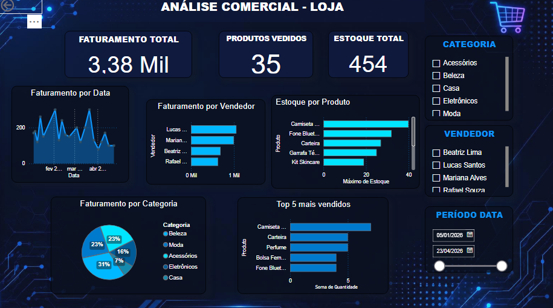

# 📊 Análise Comercial - Loja

Dashboard de análise comercial desenvolvido no Power BI para acompanhamento de vendas, faturamento e estoque.

## 📌 Sobre o projeto

Projeto desenvolvido para fins de estudo e prática em Análise de Dados e Business Intelligence, utilizando o Power BI para transformar dados comerciais em informações visuais e facilitar a análise dos resultados da loja.
> 📚 **Observação:** Os dados utilizados neste projeto são fictícios e foram criados exclusivamente para fins de estudo e demonstração.

## 🎯 Objetivo

O objetivo deste projeto é desenvolver um dashboard interativo para análise de dados comerciais, permitindo visualizar de forma simples e organizada informações relacionadas ao faturamento, vendas, estoque, categorias e desempenho dos vendedores.

## 🛠️ Ferramentas utilizadas

- Power BI;
- Power Query;
- DAX;
- GitHub.

 ## 📁 Arquivos do projeto

- `Analise_Comercial_Loja.pbix` — arquivo principal do projeto desenvolvido no Power BI, contendo o dashboard, visualizações, filtros e análises comerciais.
- `Analise_Comercial.png` — imagem de apresentação do dashboard desenvolvido.

 ## 📊 Indicadores e análises

O dashboard apresenta os seguintes indicadores e análises:

- 💰 Faturamento total;
- 🛒 Produtos vendidos;
- 📦 Estoque total;
- 📈 Faturamento por data;
- 👤 Faturamento por vendedor;
- 🥧 Faturamento por categoria;
- 🏆 Top 5 produtos mais vendidos;
- 🔎 Filtros por categoria, vendedor e período.

  ## 🖥️ Dashboard

🎥 Demonstração do Dashboard

Confira uma breve demonstração da navegação pelo dashboard e dos principais recursos desenvolvidos no Power BI.

▶️ "Assistir à demonstração" (./Dashboard-Power-BI.mp4)

📖Considerações Finais

O desenvolvimento deste projeto possibilitou aplicar conhecimentos relacionados à organização, tratamento e análise de dados utilizando o Power BI. A construção do dashboard permitiu transformar dados fictícios em informações visuais, facilitando a compreensão dos principais indicadores financeiros e apoiando a análise dos resultados da loja.

Além da prática com a ferramenta, o projeto contribuiu para o desenvolvimento de habilidades relacionadas à análise de dados, criação de visualizações e apresentação de informações de forma clara e objetiva. A experiência também serviu como oportunidade para aprimorar conhecimentos que podem ser aplicados em futuros projetos acadêmicos e profissionais.

💙Autora

Larissa Cruz
Estudante de Análise e Desenvolvimento de Sistemas (ADS)

Projeto desenvolvido para fins acadêmicos e de portfólio.
